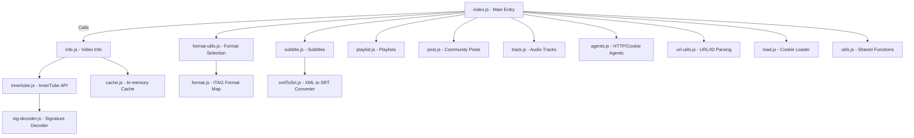

# cloud-ytdl next version

**cloud-ytdl** is a modern, production-ready YouTube downloader and data scraper built on top of official YouTube InnerTube API clients (primarily the Android client). Unlike many other libraries, it provides robust support for downloading and scraping video, live streams, community posts (text, images, polls), playlists, and subtitles/captions, while also handling signature/cipher decryption internally.


**Author:** [AlfiDev](https://github.com/cloudkuimages)  
**Repository:** [github.com/cloudkuimages/cloud-ytdl](https://github.com/cloudkuimages/cloud-ytdl)  
**Fork:**[YT-DLP](https://github.com/yt-dlp/yt-dlp)

---

## 🌟 Key Features

- **Official InnerTube Client** – Uses real YouTube Android API for reliable data extraction.
- **Signature Decoding** – Handles encrypted signature/cipher transparently.
- **Restricted Videos** – Download age-restricted/region-locked/member-only videos using cookies.
- **Community Post Extraction** – Scrape text, images, and polls from YouTube community posts.
- **Subtitle/Caption Download** – Download subtitles as XML or SRT.
- **Playlist Extraction** – Get all videos in playlists/radios.
- **Multi-Format Support** – MP4, WebM, M4A, DASH, HLS, and more.
- **Stream Support** – HLS and DASH streaming.
- **Cookie/Proxy Agent Support** – Use cookies from browser or proxy for restricted/private videos.
- **Modern Node.js** – Requires Node 18+ (uses undici and modern async/await patterns).
- **Event-based Streaming** – Download with progress, error, and info events.

---

## 🚀 Quick Start

### Installation

```bash
npm install cloud-ytdl
```

### Basic Video Download

```js
const ytdl = require('cloud-ytdl');
const fs = require('fs');

ytdl('https://www.youtube.com/watch?v=dQw4w9WgXcQ')
  .pipe(fs.createWriteStream('video.mp4'));
```

### Download with Specific Quality or Filters

```js
// Highest quality
ytdl('VIDEO_URL', { quality: 'highest' })
  .pipe(fs.createWriteStream('video.mp4'));

// 1080p only (ITAG 137)
ytdl('VIDEO_URL', { quality: 137 })
  .pipe(fs.createWriteStream('video-1080p.mp4'));

// Audio only
ytdl('VIDEO_URL', { filter: 'audioonly' })
  .pipe(fs.createWriteStream('audio.m4a'));
```

---

## 📚 API Documentation

### Core Functionality

Below are the main functions and classes exposed by the library, with detailed descriptions and usage.

---

### ytdl(url, [options])

Download a YouTube video as a readable stream. Emits Node.js stream events (`info`, `progress`, `error`, etc.).

- **Parameters:**
  - `url` (string): YouTube video URL or ID.
  - `options` (object, optional): Download options.

- **Returns:** `ReadableStream`

- **Events:**
  - `info` – Video info and selected format.
  - `progress` – Download progress (chunk size, downloaded, total).
  - `data` – Raw data chunk.
  - `end` – Download finished.
  - `error` – Error occurred.

#### Example

```js
const ytdl = require('cloud-ytdl');
const fs = require('fs');

const video = ytdl('https://www.youtube.com/watch?v=dQw4w9WgXcQ', { quality: 'highest' });
video.on('progress', (chunkLength, downloaded) => {
  console.log(`Downloaded: ${downloaded} bytes`);
});
video.pipe(fs.createWriteStream('video.mp4'));
```

---

### ytdl.getInfo(url, [options])

Fetch full metadata and format info for a video.

- **Parameters:**
  - `url` (string): Video URL or ID.
  - `options` (object, optional): { lang, requestOptions, agent, ... }

- **Returns:** `Promise<Object>` (video info structure)

#### Example

```js
const info = await ytdl.getInfo('https://youtu.be/dQw4w9WgXcQ');
console.log(info.videoDetails.title);
console.log(info.formats.map(f => f.qualityLabel));
```

#### Response Structure

```js
{
  videoDetails: {/* ... */},
  player_response: {/* ... */},
  formats: [/* ... */],
  html5player: "url"
}
```

---

### ytdl.getBasicInfo(url, [options])

Fetch lighter, faster video info (title, channel, duration) without format details.

- **Returns:** `Promise<Object>`

#### Example

```js
const info = await ytdl.getBasicInfo('dQw4w9WgXcQ');
console.log(info.videoDetails.title, info.videoDetails.lengthSeconds);
```

---

### ytdl.downloadFromInfo(info, [options])

Stream download directly from a previously obtained `info` object.

- **Parameters:**
  - `info` (object): Result from `ytdl.getInfo()`
  - `options` (object): As in main download.

- **Returns:** `ReadableStream`

#### Example

```js
const info = await ytdl.getInfo('VIDEO_URL');
const format = ytdl.chooseFormat(info.formats, { quality: 'highest' });
ytdl.downloadFromInfo(info, { format }).pipe(fs.createWriteStream('video.mp4'));
```

---

### ytdl.chooseFormat(formats, [options])

Select a format from a list based on quality or filter.

- **Parameters:**
  - `formats` (array): Formats from info/formats.
  - `options` (object): { quality, filter, format }

- **Returns:** `Object` (format)

#### Example

```js
const info = await ytdl.getInfo('VIDEO_URL');
const best = ytdl.chooseFormat(info.formats, { quality: 'highest' });
```

---

### ytdl.filterFormats(formats, [filter])

Filter formats by type (audio/video/progressive) or custom function.

- **Parameters:**
  - `formats` (array): Array of format objects.
  - `filter` (string | function): Predefined string or custom function.

- **Returns:** `Array`

#### Example

```js
const info = await ytdl.getInfo('VIDEO_URL');
const audioFormats = ytdl.filterFormats(info.formats, 'audioonly');
```

---

### ytdl.getSubtitles(videoId, [options])

Get subtitles as XML or converted SRT.

- **Parameters:**
  - `videoId` (string): Video ID or URL.
  - `options` (object): { lang, format, cookie }

- **Returns:** `Promise<string|null>`

#### Example

```js
const subs = await ytdl.getSubtitles('dQw4w9WgXcQ', { lang: 'en', format: 'srt' });
if (subs) fs.writeFileSync('subs.srt', subs);
```

---

### ytdl.getPlaylistInfo(url, [options])

Get information and video list of a playlist.

- **Parameters:**
  - `url` (string): Playlist URL.
  - `options` (object): { agent }

- **Returns:** `Promise<Object>`

#### Example

```js
const playlist = await ytdl.getPlaylistInfo('https://www.youtube.com/playlist?list=PL...');
console.log(playlist.title, playlist.items.length);
```

---

### ytdl.getPostInfo(url, [options])

Extract data from YouTube Community Posts.

- **Parameters:**
  - `url` (string): Post URL.
  - `options` (object): { lang, headers }

- **Returns:** `Promise<Object>`

#### Example

```js
const post = await ytdl.getPostInfo('https://www.youtube.com/post/Ugkx...');
console.log(post.content, post.images, post.poll);
```

---

### ytdl.validateID(id)

Validate if a string is a valid YouTube video ID.

- **Returns:** `boolean`

#### Example

```js
ytdl.validateID('dQw4w9WgXcQ'); // true
```

---

### ytdl.validateURL(url)

Validate if a string is a valid YouTube URL.

- **Returns:** `boolean`

#### Example

```js
ytdl.validateURL('https://www.youtube.com/watch?v=dQw4w9WgXcQ'); // true
```

---

### ytdl.getURLVideoID(url)

Extract the video ID from a YouTube URL.

- **Returns:** `string` (ID)

- **Throws:** If the ID cannot be found or is invalid.

#### Example

```js
ytdl.getURLVideoID('https://youtu.be/dQw4w9WgXcQ'); // 'dQw4w9WgXcQ'
```

---

### ytdl.getVideoID(str)

Extract or validate a string as a video ID.

- **Returns:** `string` (ID)

- **Throws:** If invalid.

#### Example

```js
ytdl.getVideoID('dQw4w9WgXcQ'); // 'dQw4w9WgXcQ'
```

---

### ytdl.createAgent([cookies], [options])

Create an HTTP agent with attached cookies for restricted videos.

- **Parameters:**
  - `cookies` (array | string): Cookie array or cookie string.
  - `options` (object): Agent options.

- **Returns:** `object` (agent)

#### Example

```js
const agent = ytdl.createAgent('VISITOR_INFO1_LIVE=xxx; YSC=yyy; ...');
ytdl('VIDEO_URL', { agent }).pipe(fs.createWriteStream('video.mp4'));
```

---

### ytdl.createProxyAgent(options, [cookies])

Create an HTTP agent with proxy and cookies.

- **Parameters:**
  - `options` (object | string): Proxy URI or options.
  - `cookies` (array | string): Optional cookies.

- **Returns:** `object` (agent)

#### Example

```js
const agent = ytdl.createProxyAgent('http://proxy.example.com:8080');
ytdl('VIDEO_URL', { agent }).pipe(fs.createWriteStream('video.mp4'));
```

---

### ytdl.pickAudioTrack(info, options)

Select the best audio track for a given language and info object. Useful for multi-audio videos.

- **Parameters:**
  - `info` (object): Info object from `getInfo`.
  - `options` (object): { lang, cookies }

- **Returns:** `object` (track info or null)

#### Example

```js
const info = await ytdl.getInfo('VIDEO_URL');
const track = ytdl.pickAudioTrack(info, { lang: 'en', cookies: '...' });
console.log(track.langName, track.bestFormat);
```

---

### ytdl.listAudioTrack(info, options)

List all available audio tracks in a video.

- **Parameters:**
  - `info` (object): Info object.
  - `options` (object): { silent }

- **Returns:** `array` (list of tracks)

#### Example

```js
const info = await ytdl.getInfo('VIDEO_URL');
ytdl.listAudioTrack(info);
```

---

## 🎯 Download Options

All download and info functions accept a rich options object:

```js
{
  quality: 'lowest' | 'highest' | 'highestaudio' | ... | number,
  filter: 'audioandvideo' | 'audioonly' | function,
  format: {}, // specific format object
  requestOptions: {
    headers: { Cookie: '...' },
    agent: {},
    dispatcher: {},
    timeout: 30000,
    maxRetries: 3,
    backoff: { inc: 500, max: 5000 }
  },
  agent: {}, // from createAgent/createProxyAgent
  range: { start: 0, end: 1000000 },
  begin: 0 | '00:01:00',
  liveBuffer: 20000,
  highWaterMark: 512 * 1024,
  IPv6Block: '2001:db8::/64'
}
```

---

## 🧩 Example: Using Low-Level Functions

You can use building blocks directly for advanced use-cases.

### Example: Extract Audio (Best M4A)

```js
const info = await ytdl.getInfo('VIDEO_URL');
const bestAudio = ytdl.filterFormats(info.formats, 'audioonly')
                      .sort((a, b) => (b.audioBitrate || 0) - (a.audioBitrate || 0))[0];
ytdl('VIDEO_URL', { format: bestAudio }).pipe(fs.createWriteStream('audio.m4a'));
```

### Example: Download Subtitles as SRT

```js
const subtitles = await ytdl.getSubtitles('VIDEO_ID', { lang: 'en', format: 'srt' });
fs.writeFileSync('subtitles.srt', subtitles);
```

---

## 🔑 Downloading Restricted Videos

YouTube restricts some videos (age, region, membership). To bypass:

### 1. Export Cookies from Browser

- Use [Cookie-Editor](https://cookie-editor.com/) to export YouTube cookies.
- Paste them into your code:

```js
const agent = ytdl.createAgent('VISITOR_INFO1_LIVE=xxx; YSC=yyy; ...');
ytdl('VIDEO_URL', { agent }).pipe(fs.createWriteStream('video.mp4'));
```

### 2. From Cookie File

```js
const cookieString = fs.readFileSync('.youtube-cookies.txt', 'utf8');
const agent = ytdl.createAgent(cookieString);
ytdl('VIDEO_URL', { agent }).pipe(fs.createWriteStream('video.mp4'));
```

---

```card
{
  "title": "Security Warning",
  "content": "Treat cookie strings as passwords. Never share or commit them to version control."
}
```

---

## 🔬 ITAG Reference Table

ITAGs define available formats per video. Use `getInfo()` to list all for a specific video.

| ITAG | Container | Quality   | Video | Audio | Description         |
|------|-----------|-----------|-------|-------|---------------------|
| 18   | mp4       | 360p      | ✔     | ✔     | Progressive, H.264  |
| 22   | mp4       | 720p      | ✔     | ✔     | Progressive, H.264  |
| 137  | mp4       | 1080p     | ✔     | -     | Video-only, H.264   |
| 140  | m4a       | audio     | -     | ✔     | Audio-only, AAC     |
| 251  | webm      | audio     | -     | ✔     | Audio-only, Opus    |
| ...  | ...       | ...       | ...   | ...   | ...                 |

Full map: see [format.js](./format.js).

---

## ⚙️ Advanced Examples

### Download Video and Audio Separately

```js
const info = await ytdl.getInfo('VIDEO_URL');
const bestVideo = ytdl.chooseFormat(info.formats, { quality: 'highestvideo' });
const bestAudio = ytdl.chooseFormat(info.formats, { quality: 'highestaudio' });

ytdl.downloadFromInfo(info, { format: bestVideo }).pipe(fs.createWriteStream('video-only.mp4'));
ytdl.downloadFromInfo(info, { format: bestAudio }).pipe(fs.createWriteStream('audio-only.m4a'));
```

### Download with Progress

```js
const video = ytdl('VIDEO_URL');
let downloaded = 0;
video.on('progress', (chunk, total) => {
  downloaded += chunk;
  console.log(`Progress: ${((downloaded / total) * 100).toFixed(2)}%`);
});
video.pipe(fs.createWriteStream('video.mp4'));
```

### Get Playlist Info

```js
const playlist = await ytdl.getPlaylistInfo('PLAYLIST_URL');
console.log(`Playlist: ${playlist.title} (${playlist.items.length} videos)`);
```

### Get Community Post Info

```js
const post = await ytdl.getPostInfo('https://www.youtube.com/post/Ugkx...');
console.log(post.content, post.images, post.poll);
```

---

## 🛠️ Troubleshooting

### 403 Forbidden

- Use valid cookies for age/region/member videos.

### Format Not Found

- Check available formats with `getInfo()`.

### Signature Decoding Error

- The library handles signature decryption. If you see errors, update cookies.

---

## 🏗️ Library Structure and Internal Modules

Here's an overview of the project's main files and their responsibilities:



---

## 📦 Classes and Utilities

### Cache (cache.js)

In-memory cache with time-based expiry.

- **Methods:**
  - `get(key)`
  - `set(key, value)`
  - `getOrSet(key, fn)`
  - `delete(key)`
  - `clear()`

**Usage:**

```js
const Cache = require('./cache');
const c = new Cache(60_000); // 1 min expiry
```

---

### SignatureDecoder (sig-decoder.js)

Handles extraction and execution of YouTube's signature/cipher algorithms.

- **Methods:**
  - `getCachedPlayerScript()`
  - `getCipherScript(url)`
  - `applyCipher(sig, cipher)`
  - `transformNParameter(n, cipher)`
  - `resolveFormatUrl(format, playerScript)`
  - `clearCache()`

**Exceptions:**  
Throws when cipher extraction or signature decryption fails.

---

### Agent Utilities (agents.js)

- `createAgent(cookies, options)` – Returns HTTP agent with cookies.
- `createProxyAgent(options, cookies)` – Returns agent with proxy and cookies.
- `addCookies(jar, cookies)` – Adds cookies to jar.
- `addCookiesFromString(jar, string)` – Parses and adds cookies.

---

### Utility Functions (utils.js)

- String and JSON extraction (`between`, `extractYouTubeJSON`)
- Error handling (`playError`, `UnrecoverableError`)
- Network helpers (`request`, `applyDefaultAgent`, etc.)
- IPv6 randomization for proxy rotation
- Misc: parse time, parse abbreviated numbers, etc.

---

### Format Utilities (format-utils.js)

- `chooseFormat(formats, options)` – Selects format by quality/filter.
- `filterFormats(formats, filter)` – Returns filtered list.
- `addFormatMeta(format)` – Normalizes format structure.

---

### Audio Track Utilities (track.js)

- `pickAudioTrack(info, options)` – Choose best track for a language.
- `listAudioTrack(info, options)` – List all available tracks.

---

### URL Utilities (url-utils.js)

- `validateID(id)` – Checks if string is a valid video ID.
- `validateURL(url)` – Checks if string is a valid YouTube URL.
- `getURLVideoID(url)` – Extracts ID from URL.
- `getVideoID(str)` – Gets ID from string or URL.

---

### Cookie Loading (load.js)

- `loadCookieHeader(input)` – Reads cookies from string, file, or browser's JSON export.

---

### Subtitles (subtitle.js, xmlToSrt.js)

- `getSubtitles(videoId, options)` – Fetches subtitles.
- `xmlToSrt(xml)` – Converts XML to SRT.

---

### Playlists (playlist.js)

- `getPlaylistInfo(url, options)` – Fetches playlist data and items.

---

### Community Posts (post.js)

- `getPostInfo(url)` – Fetches and parses post content, images, polls.

---

## 📝 API Endpoints (Extracted from Post/Playlist Fetching)

### Get Playlist Info (GET)

#### /playlist (YouTube playlist page)

```api
{
  "title": "Get Playlist Info",
  "description": "Extracts playlist meta and all video items from a YouTube playlist page",
  "method": "GET",
  "baseUrl": "https://www.youtube.com",
  "endpoint": "/playlist?list={playlistId}",
  "headers": [
    { "key": "user-agent", "value": "Mozilla/5.0 ...", "required": true }
  ],
  "queryParams": [
    { "key": "list", "value": "Playlist ID", "required": true }
  ],
  "pathParams": [],
  "bodyType": "none",
  "requestBody": "",
  "responses": {
    "200": {
      "description": "Playlist and video items",
      "body": "{ \"id\": \"...\", \"title\": \"...\", \"items\": [ ... ] }"
    },
    "404": {
      "description": "Not found or private",
      "body": "{ \"error\": \"ytInitialData not found\" }"
    }
  }
}
```

---

### Get Community Post Info (GET)

#### /post (YouTube community post page)

```api
{
  "title": "Get Community Post Info",
  "description": "Fetches a YouTube Community Post's text, images, likes, poll, and author info.",
  "method": "GET",
  "baseUrl": "https://www.youtube.com",
  "endpoint": "/post/{postId}",
  "headers": [
    { "key": "user-agent", "value": "Mozilla/5.0 ...", "required": true }
  ],
  "queryParams": [],
  "pathParams": [
    { "key": "postId", "value": "Post ID", "required": true }
  ],
  "bodyType": "none",
  "requestBody": "",
  "responses": {
    "200": {
      "description": "Community post data",
      "body": "{ \"author\": \"...\", \"content\": \"...\", \"images\": [ ... ] }"
    },
    "404": {
      "description": "Not found",
      "body": "{ \"error\": \"Community post not found\" }"
    }
  }
}
```

---

## 🛡️ Requirements

- Node.js 18+
- npm or yarn

---

## 📜 License

MIT

---

## 🙏 Credits

Created by [AlfiDev](https://github.com/cloudkuimages)  
See [github.com/cloudkuimages/cloud-ytdl](https://github.com/cloudkuimages/cloud-ytdl) for source, issues, and updates.

---

```card
{
  "title": "Responsible Use",
  "content": "Please use this library in accordance with YouTube's Terms of Service. Automated large-scale downloads are discouraged."
}
```
